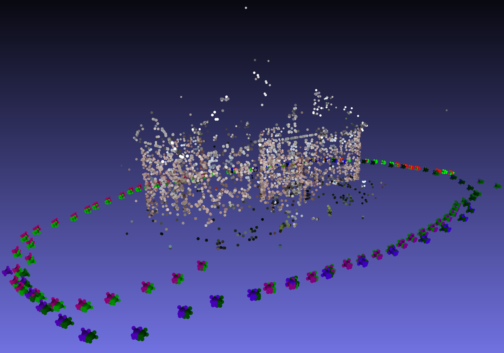

# Bundle Adjustment / Structure-from-Motion

---

**Project description:** As part of a university computer vision project, in a team of four we implemented a sparse 3D reconstruction pipeline using Structure-from-Motion and Bundle Adjustment. The project focused on estimating camera poses and 3D scene points from RGB image sequences, and then refining these estimates through non-linear optimisation.

---

  

---

  

---

### Goals

The objective was to implement and evaluate a reconstruction pipeline that:

- Reconstructs sparse 3D scenes from 2D RGB image sequences
- Estimates initial camera poses and 3D landmarks using feature matching and triangulation
- Refines camera poses and 3D points using Bundle Adjustment
- Filters unreliable images, matches, and 3D points to improve robustness
- Compares the reconstruction quality against an established baseline, COLMAP

---

### Short Description of the Project

This project explored how 3D scenes can be reconstructed from multiple 2D images taken from different viewpoints. Since individual RGB images do not contain direct depth information, the pipeline uses correspondences between images to infer camera movement and triangulate 3D points.

The implemented pipeline follows an incremental Structure-from-Motion approach. It processes images sequentially, detects feature points, matches them between frames, estimates camera poses, and triangulates corresponding 3D landmarks. These initial estimates are then refined using Bundle Adjustment, which jointly optimises camera poses and 3D point positions by minimising reprojection error.

The pipeline included several robustness measures, such as:

1. Filtering blurry images before reconstruction
2. Matching SIFT features using a ratio threshold
3. Estimating initial camera poses using the essential matrix
4. Estimating later camera poses using Perspective-n-Point with RANSAC
5. Triangulating new 3D landmarks incrementally
6. Removing outliers behind the camera or with high reprojection error
7. Filtering points that were not observed consistently across enough frames

The final implementation was tested on the TUM-RGBD dataset and the COLMAP South Building dataset. While the system reconstructed fewer points than COLMAP due to stricter filtering, it achieved strong camera pose estimates and demonstrated the importance of good initialisation before Bundle Adjustment.

---

### Technical Aspects

- **Language:** C++ / Python
- **Libraries / Tools:** OpenCV, Ceres Solver, COLMAP for comparison
- **Domain:** Computer Vision / 3D Reconstruction
- **Core Techniques:**
  - Structure-from-Motion
  - SIFT feature detection
  - FLANN-based feature matching
  - Essential matrix estimation
  - Camera pose recovery
  - Perspective-n-Point pose estimation
  - RANSAC outlier rejection
  - 3D point triangulation
  - Bundle Adjustment
  - Reprojection error minimisation
  - Outlier filtering

---

### My Contribution

I was mostly involved in the implementation of the initial estimate of camera poses and 3D points. This included:

- Implementing parts of the incremental Structure-from-Motion pipeline
- Detecting and matching image features between frames
- Computing the initial relative camera pose from the first image pair
- Triangulating the first set of 3D scene points
- Extending the reconstruction with additional frames
- Estimating new camera poses using 2D-3D correspondences
- Integrating RANSAC-based filtering to make pose estimation more robust
- Helping manage and update the set of reconstructed landmarks over time
- Contributing to the filtering of unreliable matches and outlier 3D points

---

### Reflection

This project gave me a much deeper understanding of how 3D reconstruction pipelines work internally. The most interesting part for me was the initialisation stage, because the quality of the first camera pose and point estimates strongly affects the later Bundle Adjustment step.

A key challenge was dealing with noisy feature matches and unstable triangulated points. Even small errors in the initial estimate could lead to poor reconstruction results later on, especially because Bundle Adjustment can converge to bad local minima if the starting point is not reliable. This made the project a useful exercise in robust computer vision implementation, rather than simply applying an existing reconstruction tool.
