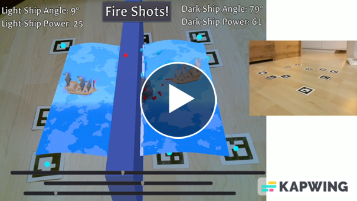

# **Naval W-AR-fare**

---

**Project description:** As part of a university course on Augmented Reality during my first Master’s semester, I developed _Naval W-AR-fare_, a ship battle minigame showcasing AR marker tracking.

<h3 align="center"><a href="https://youtu.be/YqlVb5PIins">Watch Gameplay Demo Video here</a></h3>

  

---

### Goals

The primary objective was to create a simple and engaging AR game using ArUco marker tracking with the following requirements:

- The game should be multiplayer but function with a single device, meaning only one camera is used to track the markers.
- It should be playable on any well-lit table, ensuring accessibility and convenience.

---

### Short Description of the Game

The game uses 10 ArUco markers, each contributing through their position and orientation:

- **Boundary Markers:** Four markers define the playing field’s boundaries and project a water surface onto the table, with a wall separating the two sides.
- **Ship Markers:** Two markers represent the position and orientation of each player’s ship, located on opposite sides of the wall.
- **Cannon Markers:** Four markers between the boundary markers are used to adjust the angle and power of the cannons mounted on the player’s ships.

**Gameplay**: Players set their cannon’s angle and power by adjusting the cannon markers. Both players click “fire” when they are ready, and the first player to hit their opponents ship wins

Watch a [Gameplay Demo Video here](https://youtu.be/YqlVb5PIins).

---

### Technical Aspects

- **Platform:** Windows, using any capable webcam
- **Engine:** Godot with GDScript and C++
- **Marker Detection:** Implemented using OpenCV for:
  - Sub-pixel accurate edge detection
  - Marker ID assignment

---

### My Contribution

I was responsible for:

- Implementing marker detection and functionality
- Projecting 3D objects onto detected markers (in collaboration with a teammate)
- Developing the underlying game logic

---
