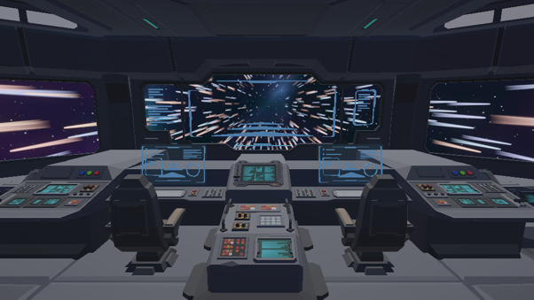
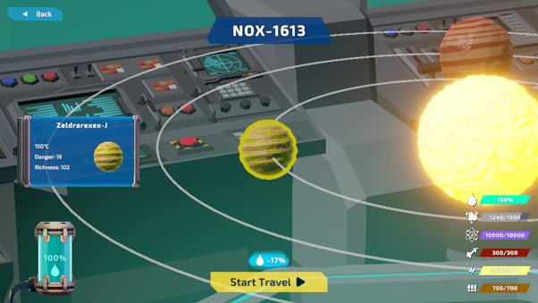
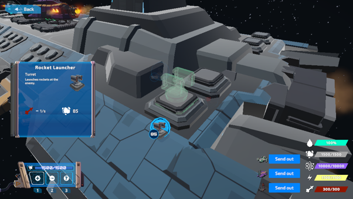
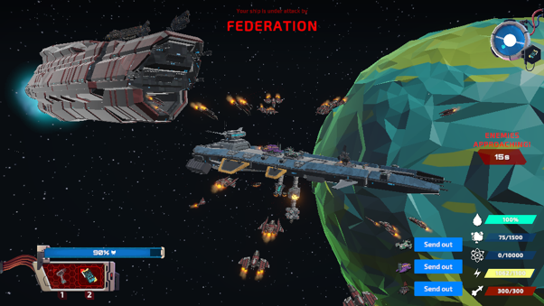
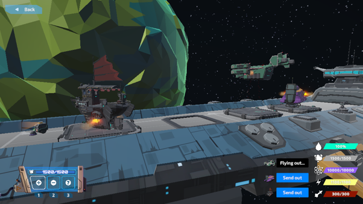

# Spacetopia

---

**Project description:** As part of a university game development project, in a team of two we developed *Spacetopia*, a 3D space-station management game. The project focused on modular ship construction, resource management, exploration, and defensive gameplay systems.

<!-- Optional trailer section, if you have one later:
<h3 align="center"><a href="YOUR_LINK_HERE">Watch Game Trailer here</a></h3>

  

-->

  

  

  

---

### Goals

The objective was to create a game that:

- Let the player build and expand a modular spaceship in 3D space
- Combined resource management with tower-defense-inspired threats
- Used a node-based exploration system to travel between different space sectors
- Created an open-ended experience fitting the theme **“Road to Nowhere”**
- Encouraged strategic decisions through module placement, crew management, and resource scarcity

---

### Short Description of the Game

In *Spacetopia*, the player takes on the role of a captain who wakes up from cryo-sleep after 150 years at the edge of the mapped galaxy. Starting with a damaged but functional spaceship, the player has to rebuild, expand, and manage the ship while travelling deeper into unknown space.

The core of the ship is protected by the **Aegis Barrier**, a powerful shield that blocks incoming debris, attacks, and other hazards. To keep the ship alive, the player must manage resources such as energy, fuel, water, oxygen, materials, and crew.

The player expands the ship by placing modules onto a structural skeleton. These modules include living quarters, energy generators, turrets, radar systems, resource collectors, and other support systems. As the ship grows, the player can recruit different species, explore new sectors, gather resources, and defend against hostile raids.

The main gameplay loop consists of:

1. Travelling to a new space sector
2. Gathering resources and managing the ship
3. Building or upgrading modules
4. Reacting to events such as raids, malfunctions, or discoveries
5. Choosing the next destination on the space map

  

  

  

---

### Technical Aspects

- **Platform:** Windows
- **Engine:** Unity3D with C#
- **Genre:** 3D management / building game with tower-defense and exploration elements
- **Camera:** Third-person orbital camera for inspecting the ship from different angles
- **Art Style:** Low-poly sci-fi style
- **Core Systems:**
  - Modular ship-building system
  - Resource management system
  - Crew and module operation logic
  - Defensive turret system
  - Enemy raid behaviour
  - Node-based space exploration
  - In-game UI for resources, build mode, travel, and fleet/scavenger status

---

### My Contribution

I was responsible for the following:

- Designing and implementing parts of the modular ship-building system
- Creating the logic for placing, validating, and expanding ship modules
- Working on the graph/tree structure used to manage connected modules, turrets, and ship components
- Contributing to the resource management system and how modules produce, consume, and interact with resources
- Helping implement the main gameplay loop, including:
  - Building and upgrading the ship
  - Managing resources
  - Preparing for travel between sectors
  - Reacting to raids and crisis events
- Contributing to the UI flow for resource display, build mode, and ship management
- Helping polish the final prototype and adapt the scope after the team was reduced to two people

---
