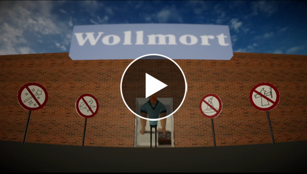

# Wizzards At Wollmort

---

**Project description:** As part of a university project during my first Master’s semester, in a team of three we developed a VR game called Wizzards at Wollmort. The project focused on implementing novel 3D user interaction methods.

<h3 align="center"><a href="https://youtu.be/D69Uwug74bE">Watch Game Trailer here</a></h3>

  

---

### Goals

The objective was to create a game or application that:

- Utilized at least one 6-DoF input controller
- Included the following features:
  - **Selection Task:** A novel method for interacting with objects
  - **Manipulation Task:** A novel method for manipulating objects
  - **Wayfinding Aids:** Tools to assist navigation within a 3D world

---

### Short Description of the Game

In Wizzards at Wollmort, the player assumes the role of a small wizard tasked with collecting items in a large supermarket. Adding an element of challenge, an NPC security guard chases the player throughout the supermarket. The game incorporates five unique spells:

1. **Telekinetic Grab Spell:** Pull items closer when they are out of reach.
2. **Shrink/Grow Spell:** Resize objects to fit them into the player’s shopping bag.
3. **Guard Teleport Spell:** Teleport the guard to a random location in the supermarket when they get too close.
4. **Pillar of Light Spell:** Highlight the next search area for an item on the shopping list.
5. **Shopping Portal Spell:** A pseudo-shopping bag to collect and store items.

The player tracks their progress using a shopping list displayed on their wrist, marking items collected and those remaining.

Watch a [Game Trailer here](https://youtu.be/D69Uwug74bE).

---

### Technical Aspects

- **Platform:** Windows, using the Oculus Rift VR headset
- **Engine:** Unity3D with C#

---

### My Contribution

I was responsible for the following:

- Helping with designing and planning the novel interaction techniques
- Creating the 3D virtual supermarket environment with interactable objects in Unity3D
- Implementing the NPC guard behaviour using NavMesh for navigation
- Implementing the overall game logic, including:
  - Game loop
  - Item collection logic
  - Game win/loss logic
