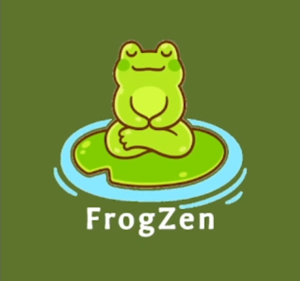
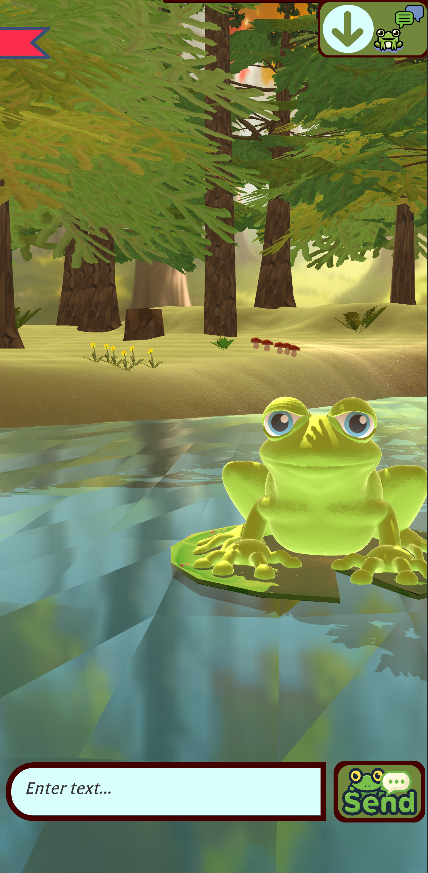
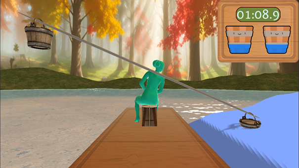
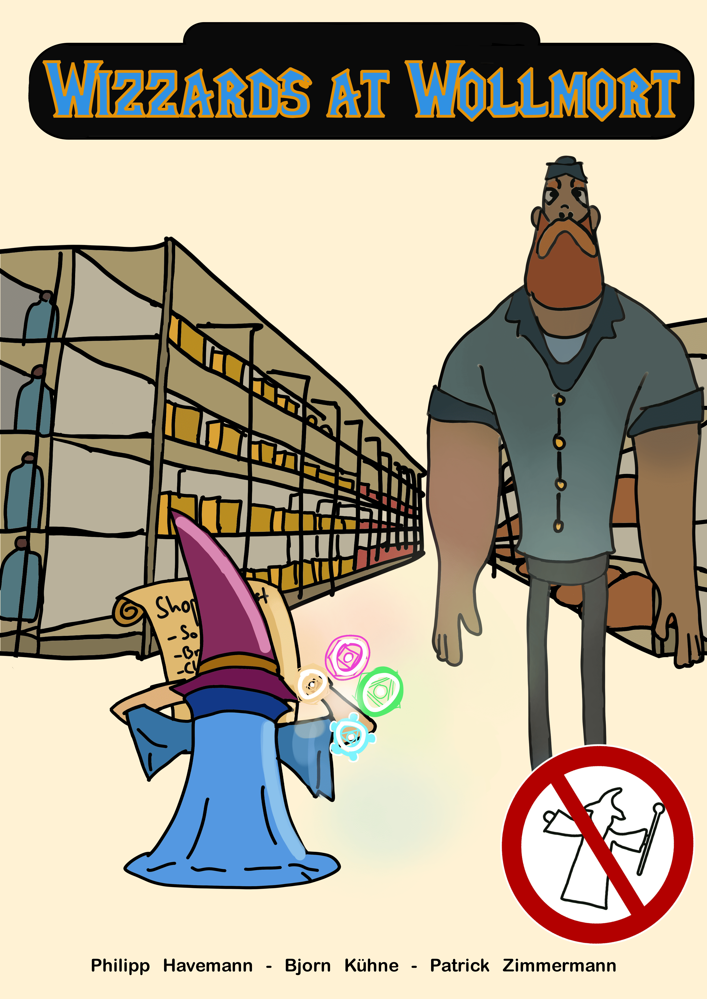

<h1> Portfolio </h1>

---

### Projects

---
<h3 align="center"><a href="/FrogZen_ProjectPage">FrogZen</a></h3>

  

---

<h3 align="center"><a href="/LumbarLagoon_ProjectPage">LumbarLagoon</a></h3>

---
<h3 align="center"><a href="/WAW_ProjectPage">Wizzards At Wollmort</a></h3>

---
<h3 align="center"><a href="/NavalWarfare_ProjectPage">Naval W-AR-fare</a></h3>

---

<h3 align="center"><a href="/BNP_ProjectPage">B.A.R.K and P.I.S.S</a></h3>

---

<h1 align="center"> Title </h1>

<h1 align="center">[B.A.R.K and P.I.S.S](/BNP_ProjectPage)</h1>

### Category Name 2

- [Project 1 Title](http://example.com/)
- [Project 2 Title](http://example.com/)
- [Project 3 Title](http://example.com/)
- [Project 4 Title](http://example.com/)
- [Project 5 Title](http://example.com/)

---

---

Page template forked from <a href="https://github.com/evanca/quick-portfolio">evanca</a>

<!-- Remove above link if you don't want to attibute -->
