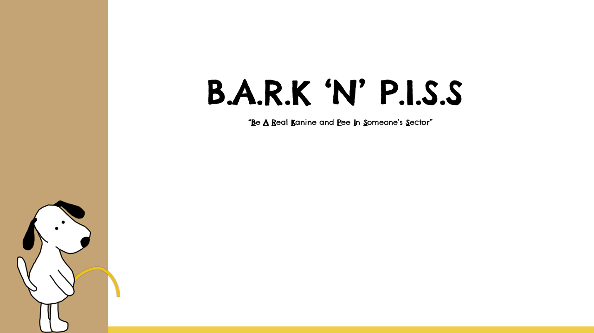

<h1> Portfolio </h1>

---

### Projects

---
<h3 align="center"><a href="/FrogZen_ProjectPage">FrogZen</a></h3>

  

---

<h3 align="center"><a href="/LumbarLagoon_ProjectPage">LumbarLagoon</a></h3>

  

---

<h3 align="center"><a href="/WAW_ProjectPage">Wizzards At Wollmort</a></h3>

  

---
<h3 align="center"><a href="/NavalWarfare_ProjectPage">Naval W-AR-fare</a></h3>

  

---

<h3 align="center"><a href="/BNP_ProjectPage">B.A.R.K and P.I.S.S</a></h3>

  

---

---

Page template forked from <a href="https://github.com/evanca/quick-portfolio">evanca</a>

<!-- Remove above link if you don't want to attibute -->
